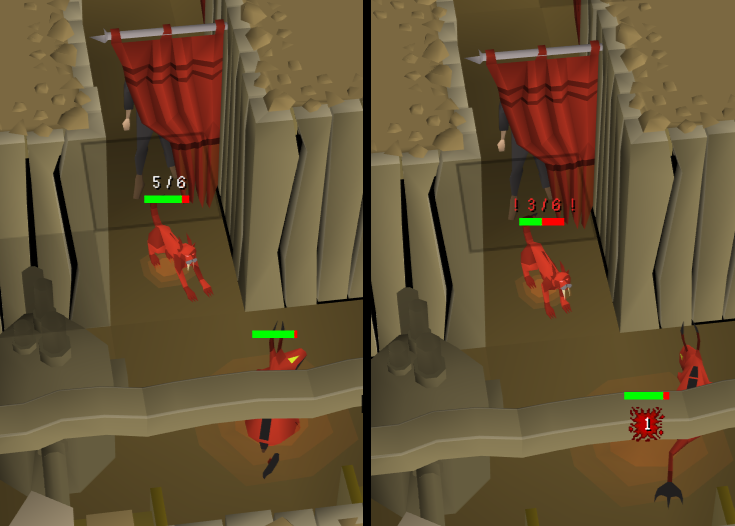
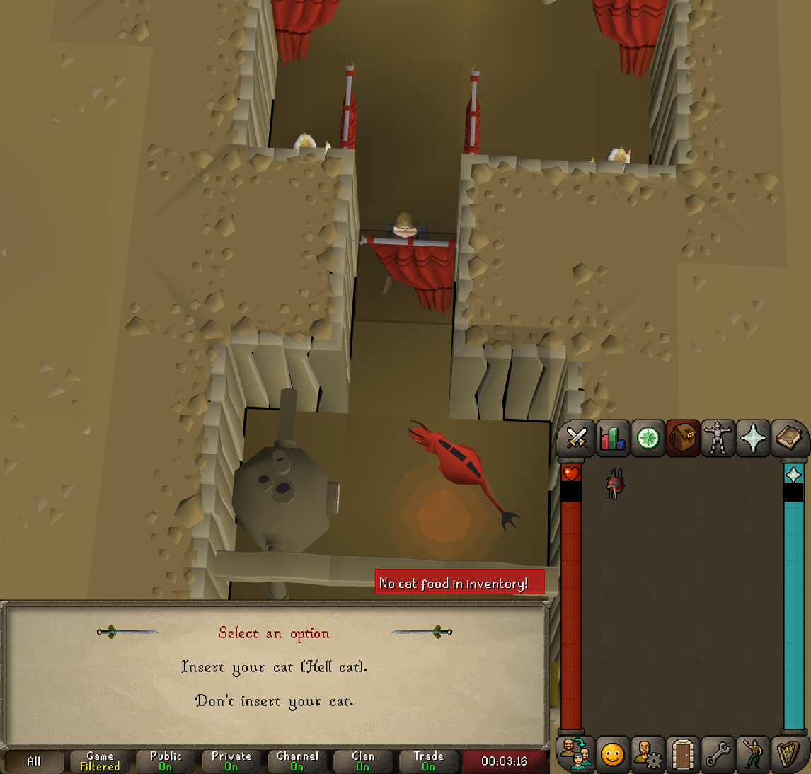
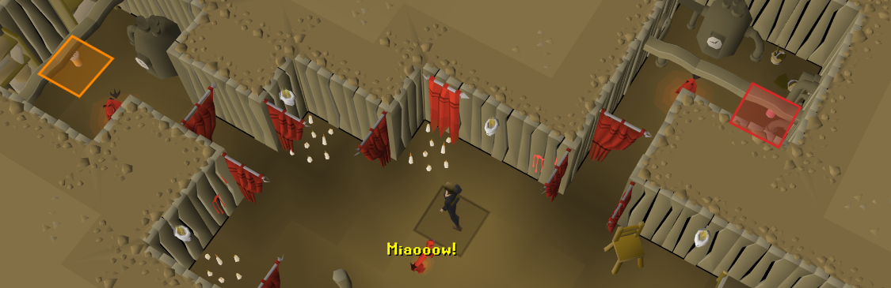
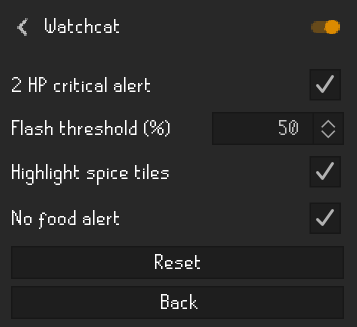

# Watchcat

Watchcat helps protect player-owned cats while fighting Hell-Rat Behemoths in Evil Dave's basement.

## Features

- Displays the cat's exact current and maximum hitpoints above its health bar.
- Flashes the health display at a configurable percentage threshold.
- Sends a notification and flashes the screen when the cat reaches 2 hitpoints or fewer.
- Warns before starting a fight when the inventory contains no supported fish or milk.
- Highlights the four spice piles using their corresponding red, orange, yellow, and brown colours.
- Runs only inside Evil Dave's basement.

All alerts and spice tile highlights can be configured from the RuneLite plugin settings.

## Screenshots

### Cat health and low-health warning



### No-food warning



### Spice tile highlights



### Settings



## Development

Watchcat requires Java 11. Build it with:

```shell
./gradlew build
```

Run a development client with:

```shell
./gradlew run
```
